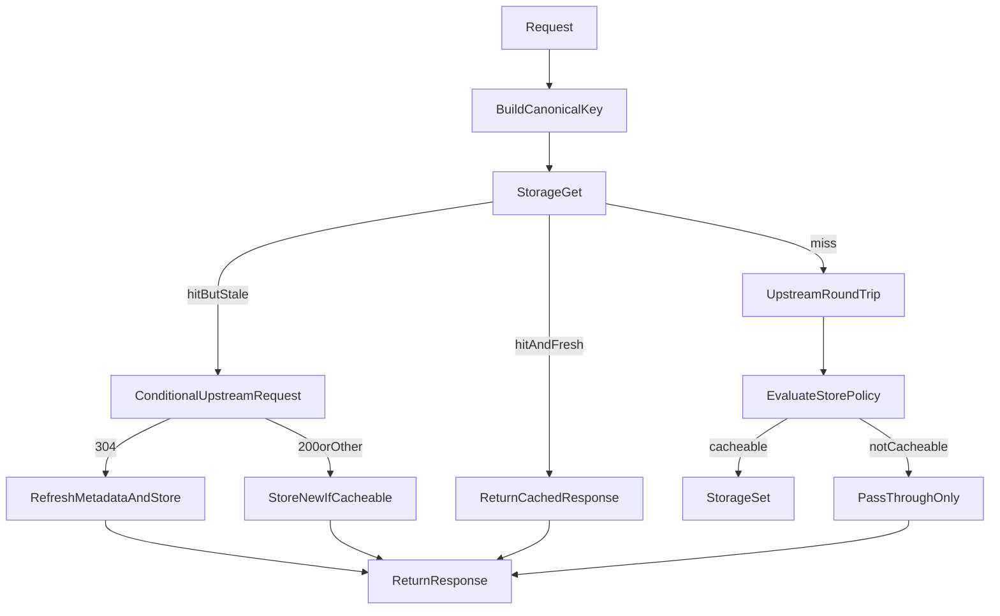

# httpccache request and response flow

```mermaid
flowchart TD
  reqIn[Request] --> cacheKey[BuildCanonicalKey]
  cacheKey --> lookup[StorageGet]
  lookup -->|hitAndFresh| serve[ReturnCachedResponse]
  lookup -->|hitButStale| revalidate[ConditionalUpstreamRequest]
  lookup -->|miss| upstream[UpstreamRoundTrip]
  revalidate -->|304| refresh[RefreshMetadataAndStore]
  revalidate -->|200orOther| replace[StoreNewIfCacheable]
  upstream --> policy[EvaluateStorePolicy]
  policy -->|cacheable| store[StorageSet]
  policy -->|notCacheable| pass[PassThroughOnly]
  refresh --> out[ReturnResponse]
  replace --> out
  serve --> out
  pass --> out
```

